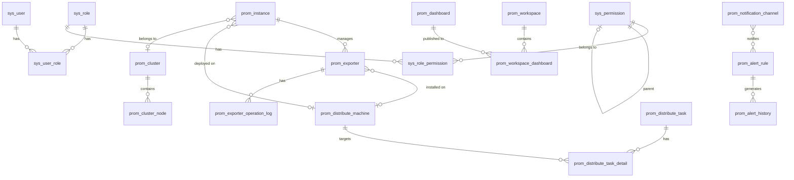

# 后端架构文档

> Prometheus 集群监控管理平台 - 后端架构设计说明

## 目录

- [系统架构概览](#系统架构概览)
- [Spring Boot 分层架构](#spring-boot-分层架构)
- [业务模块结构](#业务模块结构)
- [安全架构](#安全架构)
- [数据库设计](#数据库设计)
- [缓存架构](#缓存架构)
- [WebSocket 架构](#websocket-架构)
- [调度器与异步任务](#调度器与异步任务)
- [设计模式](#设计模式)
- [依赖关系](#依赖关系)

---

## 系统架构概览

```
                          +-----------------------+
                          |     前端 (Vue 3)       |
                          |   Port: 3006          |
                          +----------+------------+
                                     |
                              HTTP / WebSocket
                                     |
                          +----------v------------+
                          |     Nginx 反向代理     |
                          |  /api/* -> :8080      |
                          |  /ws/*  -> :8080 (WS) |
                          +----------+------------+
                                     |
                  +------------------+------------------+
                  |                                     |
         +--------v--------+                   +--------v--------+
         |   REST API       |                   |   WebSocket     |
         |  /api/auth/*     |                   |  /ws/distribute |
         |  /api/prometheus |                   |  /ws/message    |
         |       /*         |                   |  /ws/cluster-   |
         +--------+---------+                   |    topology     |
                  |                             +--------+--------+
                  |                                      |
         +--------v-----------------------------------------v--------+
         |                Spring Boot Application (Port: 8080)       |
         |                                                           |
         |  +-----------------------------------------------------+  |
         |  |              Security Filter Chain                   |  |
         |  |  CORS -> JWT Filter -> Authorization -> Controller   |  |
         |  +-----------------------------------------------------+  |
         |                                                           |
         |  +-----------------------------------------------------+  |
         |  |               Business Modules (11)                  |  |
         |  |  auth | datasource | dashboard | query | alert       |  |
         |  |  cluster | permission | workspace | distribute       |  |
         |  |  panel | settings                                    |  |
         |  +-----------------------------------------------------+  |
         |                                                           |
         |  +-----------------------------------------------------+  |
         |  |              Infrastructure Layer                    |  |
         |  |  Cache (Caffeine) | Scheduler | Async | AOP          |  |
         |  |  WebSocket | SSH Pool | RestTemplate                 |  |
         |  +-----------------------------------------------------+  |
         |                                                           |
         |  +-----------------------------------------------------+  |
         |  |              Data Access Layer                       |  |
         |  |  MyBatis-Plus Mapper | HikariCP Connection Pool      |  |
         |  +-----------------------------------------------------+  |
         |                                                           |
         +----------------------------+------------------------------+
                                      |
                    +-----------------+-----------------+
                    |                                   |
            +-------v-------+                   +-------v-------+
            |   MySQL 8.0   |                   |  Prometheus   |
            |   Port: 3306  |                   |  Port: 9090   |
            |  27 张业务表   |                   | (监控数据源)  |
            +---------------+                   +---------------+
```

---

## Spring Boot 分层架构

项目严格遵循 Controller -> Service -> Mapper 三层架构，辅以 DTO/VO 进行数据传输隔离。

```
                    +------------------+
                    |   Controller     |  接收 HTTP 请求，参数校验，调用 Service
                    |  @RestController |  返回统一响应 R<T>
                    +--------+---------+
                             |
                    +--------v---------+
                    |    Service        |  核心业务逻辑
                    |  @Service         |  事务管理 @Transactional
                    |  ServiceImpl      |  调用 Mapper 数据访问
                    +--------+---------+
                             |
                    +--------v---------+
                    |    Mapper         |  MyBatis-Plus BaseMapper<Entity>
                    |  @Mapper          |  自动 CRUD + 自定义 SQL
                    +--------+---------+
                             |
                    +--------v---------+
                    |    Entity         |  数据库表映射
                    |  @TableName       |  逻辑删除 @TableLogic
                    +------------------+

    辅助层:
    +--------+     +--------+     +--------+     +--------+
    |  DTO   |     |   VO   |     | Config |     | Common |
    | 请求体  |     | 响应体  |     | 配置类  |     | 工具类  |
    +--------+     +--------+     +--------+     +--------+
```

### 各层职责

| 层级 | 包路径 | 职责 |
|------|--------|------|
| Controller | `module/{name}/controller` | 接收请求、参数校验（`@Valid`）、路由分发、返回 `R<T>` |
| Service | `module/{name}/service` | 业务逻辑编排、事务管理、异常抛出 |
| ServiceImpl | `module/{name}/service/impl` | Service 接口实现、调用 Mapper 和外部服务 |
| Mapper | `module/{name}/mapper` | 数据访问层，继承 `BaseMapper<Entity>` |
| Entity | `module/{name}/entity` | 数据库表映射，含 `@TableName`/`@TableId`/`@TableLogic`/`@Version` |
| DTO | `module/{name}/dto` | 请求数据传输对象，含 `@NotBlank`/`@Valid` 等校验注解 |
| VO | `module/{name}/vo` | 响应视图对象，用于封装返回给前端的数据 |

### 统一响应格式

所有 API 统一返回 `R<T>` 格式：

```java
public class R<T> {
    private int code;     // 状态码: 200/400/401/403/404/500
    private String msg;   // 消息
    private T data;       // 数据载荷
}
```

### 全局异常处理

`GlobalExceptionHandler` 统一捕获异常并转化为 `R<T>` 响应：

| 异常类型 | 状态码 | 说明 |
|----------|--------|------|
| `BusinessException` | 400 | 业务异常（自定义） |
| `MethodArgumentNotValidException` | 400 | 参数校验失败 |
| `AuthenticationException` | 401 | 认证失败 |
| `AccessDeniedException` | 403 | 权限不足 |
| `Exception` | 500 | 未知异常 |

---

## 业务模块结构

系统包含 **11 个业务模块** 和 **6 个基础设施模块**：

### 业务模块

```
module/
├── auth/                  # 用户认证
│   ├── controller/        #   AuthController
│   ├── dto/               #   LoginDTO
│   ├── service/           #   AuthService
│   └── vo/                #   LoginVO, UserInfoVO
│
├── datasource/            # 数据源管理 (Prometheus 实例 + Exporter + 指标元数据)
│   ├── controller/        #   DatasourceController
│   ├── dto/               #   CreateInstanceDTO, BatchCreateExporterDTO
│   ├── entity/            #   PromInstance, PromExporter, PromMetricMeta
│   ├── mapper/            #   PromInstanceMapper, PromExporterMapper
│   ├── service/           #   DatasourceService
│   └── vo/                #   ConnectionTestVO, BatchCreateResultVO
│
├── dashboard/             # 仪表盘管理
│   ├── controller/        #   DashboardController
│   ├── entity/            #   PromDashboard, PromDashboardTemplate
│   ├── mapper/            #   PromDashboardMapper
│   └── service/           #   DashboardService
│
├── query/                 # PromQL 查询
│   ├── controller/        #   QueryController
│   ├── entity/            #   PromQueryHistory, PromPromqlTemplate
│   ├── mapper/            #   PromQueryHistoryMapper, PromPromqlTemplateMapper
│   └── service/           #   QueryService
│
├── alert/                 # 告警管理
│   ├── controller/        #   AlertController
│   ├── entity/            #   PromAlertRule, PromAlertHistory, PromSilence, PromNotificationChannel
│   ├── mapper/            #   各 Entity 对应 Mapper
│   ├── notification/      #   NotificationSenderFactory, DingTalkSender, EmailSender, ...
│   ├── scheduler/         #   AlertEvaluationScheduler, AlertGroupManager
│   └── service/           #   AlertService
│
├── cluster/               # 集群管理
│   ├── controller/        #   ClusterController
│   ├── entity/            #   PromCluster, PromClusterNode
│   ├── mapper/            #   PromClusterMapper, PromClusterNodeMapper
│   └── service/           #   ClusterService
│
├── permission/            # 权限管理
│   ├── controller/        #   PermissionController
│   ├── entity/            #   SysUser, SysRole, SysPermission, SysUserRole, SysRolePermission
│   ├── mapper/            #   各 Entity 对应 Mapper
│   └── service/           #   PermissionService
│
├── workspace/             # 工作空间
│   ├── controller/        #   WorkspaceController
│   ├── entity/            #   PromWorkspace, PromWorkspaceDashboard
│   ├── mapper/            #   PromWorkspaceMapper
│   └── service/           #   WorkspaceService
│
├── distribute/            # 分布式部署
│   ├── config/            #   GitHubReleaseConfig
│   ├── controller/        #   DistributeController
│   ├── dto/               #   ComponentConfigDTO
│   ├── entity/            #   PromDistributeMachine, PromDistributeTask, ...
│   ├── mapper/            #   各 Entity 对应 Mapper
│   ├── service/           #   DistributeService, SoftwareService
│   │   └── impl/          #   DistributeServiceImpl, DistributeTaskExecutor,
│   │                      #   SoftwareServiceImpl, SoftwareDownloadExecutor,
│   │                      #   SshConnectionPool
│   ├── util/              #   ComponentConfigGenerator
│   └── vo/                #   MachineDetectVO, ComponentDetectVO, SoftwareDownloadVO, SoftwareUploadVO
│
├── panel/                 # 面板模板
│   ├── controller/        #   PanelController
│   ├── entity/            #   PromPanelTemplate
│   ├── mapper/            #   PromPanelTemplateMapper
│   └── service/           #   PanelService
│
└── settings/              # 系统设置
    ├── controller/        #   SettingsController
    ├── entity/            #   SysGlobalSettings, SysSystemLog, SysAuditLog
    ├── mapper/            #   各 Entity 对应 Mapper
    └── service/           #   SettingsService
```

### 基础设施模块

```
├── common/                # 通用工具
│   ├── result/            #   R<T> 统一响应, ResultCode 枚举
│   ├── exception/         #   BusinessException, GlobalExceptionHandler
│   └── page/              #   PageQuery, PageResult<T>
│
├── config/                # 配置类
│   ├── SecurityConfig     #   Spring Security 配置
│   ├── WebSocketConfig    #   WebSocket 端点注册
│   ├── MybatisPlusConfig  #   MyBatis-Plus 分页 + 乐观锁
│   ├── CacheConfig        #   Caffeine 缓存管理器
│   ├── AsyncConfig        #   异步线程池配置
│   ├── RestTemplateConfig #   RestTemplate + HttpClient5
│   ├── JacksonConfig      #   JSON 序列化配置
│   ├── SwaggerConfig      #   Knife4j/OpenAPI 配置
│   ├── WebMvcConfig       #   CORS 配置
│   └── SecurityKeyValidator # JWT/AES 密钥强度校验
│
├── security/              # 安全组件
│   ├── JwtTokenProvider   #   JWT 生成/验证/解析
│   ├── JwtAuthenticationFilter # JWT 过滤器 (Header + Cookie)
│   ├── LoginRateLimiter   #   登录限流器 (滑动窗口)
│   └── SecurityUser       #   Spring Security UserDetails
│
├── websocket/             # WebSocket 处理器
│   ├── DistributeWebSocketHandler   # 部署日志实时推送
│   ├── MessageWebSocketHandler      # 消息通知
│   ├── ClusterTopologyWebSocketHandler # 集群拓扑推送
│   ├── WebSocketSessionManager      # Session 管理
│   └── WebSocketAuthInterceptor     # WebSocket 认证拦截器
│
├── annotation/            # 自定义注解
│   └── AuditLog           #   审计日志注解
│
├── aspect/                # AOP 切面
│   └── AuditLogAspect     #   审计日志切面
│
└── util/                  # 工具类
    ├── AesUtil            #   AES-256-GCM 加解密
    ├── IpUtil             #   客户端 IP 获取
    └── UuidUtil           #   UUID 生成
```

---

## 安全架构

### 认证流程

```
                        用户请求
                           |
                    +------v------+
                    | CORS Filter |
                    +------+------+
                           |
                    +------v------+
                    | JWT Filter  |---> 提取 Token (Header 或 Cookie)
                    +------+------+     |
                           |            +--> Token 无效? ---> 401 Unauthorized
                           |
                    +------v------+
                    | Authorization|---> 检查请求路径权限
                    +------+------+     |
                           |            +--> 无权限? ---> 403 Forbidden
                           |
                    +------v------+
                    | Controller  |---> 处理业务逻辑
                    +-------------+
```

### JWT 双令牌机制

| Token 类型 | 有效期 | 用途 |
|-----------|--------|------|
| Access Token | 2 小时 (7200000ms) | API 请求认证 |
| Refresh Token | 7 天 (604800000ms) | 刷新 Access Token |

**Token 传输方式（双模式）：**

1. **Authorization Header**：`Authorization: Bearer <access_token>`
2. **httpOnly Cookie**：`Set-Cookie: access_token=xxx; HttpOnly; Secure; SameSite=Lax; Path=/api`

`JwtAuthenticationFilter` 优先检查 Cookie，再检查 Header。

### RBAC 权限模型

```
              SysUser (用户)
                 |
            N:M (sys_user_role)
                 |
              SysRole (角色)
                 |
            N:M (sys_role_permission)
                 |
            SysPermission (权限)
                 |
          +-----------+-----------+
          |           |           |
        menu       button        api
       (菜单)      (按钮)       (接口)
```

**内置角色：**

| 角色 | Code | 权限范围 |
|------|------|---------|
| 超级管理员 | `R_SUPER` | 所有权限 |
| 管理员 | `R_ADMIN` | 数据源/仪表盘/查询/告警/集群 |
| 普通用户 | `R_USER` | 查看数据源/仪表盘/查询/告警/集群 |
| 只读用户 | `R_VIEWER` | 查看数据源/仪表盘/集群 |

### 登录限流

`LoginRateLimiter` 使用基于内存的滑动窗口算法防止暴力破解：

| 参数 | 值 | 说明 |
|------|-----|------|
| MAX_ATTEMPTS | 5 | 窗口期内最大尝试次数 |
| WINDOW_MS | 300,000 (5min) | 滑动窗口大小 |
| LOCK_DURATION_MS | 900,000 (15min) | 超限后锁定时间 |
| cleanup 周期 | 600,000 (10min) | 定时清理过期记录 |

### 数据安全

| 场景 | 方案 |
|------|------|
| 用户密码存储 | BCrypt 哈希 (`BCryptPasswordEncoder`) |
| SSH 凭据存储 | AES-256-GCM 加密 (`AesUtil`) |
| API 认证 | JWT HMAC256 签名 |
| XSS 防护 | Security Headers (CSP, X-XSS-Protection) |
| CSRF 防护 | 无状态 JWT + SameSite Cookie |
| HSTS | `max-age=31536000; includeSubDomains` |

---

## 数据库设计

### ER 关系图



### 表分组

| 分组 | 表数量 | 表名 |
|------|--------|------|
| 认证与权限 | 5 | `sys_user`, `sys_role`, `sys_user_role`, `sys_permission`, `sys_role_permission` |
| 数据源管理 | 4 | `prom_instance`, `prom_exporter`, `prom_exporter_operation_log`, `prom_metric_meta` |
| 仪表盘 | 5 | `prom_dashboard`, `prom_dashboard_template`, `prom_panel_template`, `prom_workspace`, `prom_workspace_dashboard` |
| 查询 | 2 | `prom_query_history`, `prom_promql_template` |
| 告警 | 4 | `prom_alert_rule`, `prom_alert_history`, `prom_silence`, `prom_notification_channel` |
| 集群 | 2 | `prom_cluster`, `prom_cluster_node` |
| 系统 | 3 | `sys_audit_log`, `sys_global_settings`, `sys_system_log` |
| 分布式部署 | 4 | `prom_distribute_machine`, `prom_distribute_task`, `prom_distribute_task_detail`, `prom_distribute_software` |

总计 **29 张表**。

### 通用字段约定

| 字段 | 类型 | 说明 |
|------|------|------|
| `id` | `VARCHAR(36)` | UUID 主键 |
| `created_at` | `DATETIME` | 创建时间（自动填充） |
| `updated_at` | `DATETIME` | 更新时间（自动更新） |
| `deleted` | `INT` | 逻辑删除标记（0=未删除, 1=已删除） |
| `version` | `INT` | 乐观锁版本号（部分核心表） |

---

## 缓存架构

### Caffeine 本地缓存

使用 Spring Cache 抽象 + Caffeine 作为缓存实现：

```
                    +-------------------+
                    |  CacheManager     |
                    |  (CaffeineCacheManager)
                    +--------+----------+
                             |
               +-------------+-------------+
               |             |             |
     +---------v---+ +------v------+ +----v----------+
     | permission  | | dashboard   | | promql        |
     | Tree Cache  | | Template    | | Template      |
     | TTL: 5min   | | Tree Cache  | | Tree Cache    |
     |             | | TTL: 10min  | | TTL: 10min    |
     +-------------+ +-------------+ +---------------+
```

**缓存配置：**

| 参数 | 值 |
|------|-----|
| 最大条目数 | 500 |
| 默认过期策略 | 写入后 10 分钟 |
| 缓存驱逐策略 | 基于大小 + TTL |

**缓存应用：**

| 缓存名 | 方法 | TTL | 说明 |
|--------|------|-----|------|
| `permissionTree` | `getPermissionTree()` | 5min | 权限树结构（变更时 `@CacheEvict`） |
| `dashboardTemplateTree` | `getTemplateTree()` | 10min | 仪表盘模板分类树 |
| `promqlTemplateTree` | `getTemplateTree()` | 10min | PromQL 模板分类树 |

---

## WebSocket 架构

### 连接管理

```
                    客户端
                      |
              WebSocket 连接
                      |
            +---------v----------+
            | WebSocketAuth      |  1. 连接建立（握手阶段）
            | Interceptor        |  2. 记录 Session
            +---------+----------+
                      |
            +---------v----------+
            | WebSocket Handler  |  3. 接收消息
            |                    |  4. 认证消息: {"type":"auth","token":"eyJ..."}
            |                    |  5. 验证 JWT Token
            |                    |  6. 绑定 userId 到 Session
            +---------+----------+
                      |
            +---------v----------+
            | WebSocket Session  |  7. 推送消息给已认证客户端
            | Manager            |
            +--------------------+
```

### WebSocket 端点

| 路径 | Handler | 用途 |
|------|---------|------|
| `/ws/distribute` | `DistributeWebSocketHandler` | 部署任务日志实时推送 |
| `/ws/message` | `MessageWebSocketHandler` | 系统消息通知推送 |
| `/ws/cluster-topology` | `ClusterTopologyWebSocketHandler` | 集群拓扑定时广播（默认 30s） |

### 认证机制

WebSocket 采用消息级认证（非 URL 参数），防止 Token 泄露到服务器日志：

1. 客户端建立 WebSocket 连接（无需 Token）
2. 连接成功后发送认证消息：`{"type": "auth", "token": "eyJ..."}`
3. 服务端验证 JWT，通过则将 userId 绑定到 Session
4. 后续消息推送仅发送给已认证 Session

---

## 调度器与异步任务

### 定时调度器

```
    +---------------------------+     +---------------------------+
    | AlertEvaluationScheduler  |     | InstanceHealthScheduler   |
    | @Scheduled(fixedRate=60s) |     | @Scheduled(fixedRate=5min)|
    |                           |     |                           |
    | - 查询所有启用的告警规则    |     | - 遍历所有 Prometheus 实例 |
    | - 对每条规则执行 PromQL    |     | - GET /-/healthy 检测     |
    | - 触发告警/恢复/静默       |     | - 更新 status: online/    |
    | - 调用 AlertGroupManager  |     |   offline                |
    |   进行收敛/降噪            |     |                           |
    +---------------------------+     +---------------------------+

    +---------------------------+     +---------------------------+
    | MetadataScheduler         |     | LoginRateLimiter.cleanup  |
    | @Scheduled(fixedRate=30m) |     | @Scheduled(fixedRate=10m) |
    |                           |     |                           |
    | - 遍历在线 Prometheus 实例|     | - 清理过期锁定记录         |
    | - 拉取 /api/v1/metadata  |     | - 清理过期滑动窗口记录      |
    | - upsert 到 prom_metric_ |     |                           |
    |   meta 表                 |     |                           |
    +---------------------------+     +---------------------------+
```

### 告警收敛机制

`AlertGroupManager` 实现类似 Alertmanager 的告警分组与降噪：

```
    告警触发
       |
       v
  按 groupName:severity 分组
       |
       v
  +----+---------+
  | group_wait   |  首次告警等待 30s 收集同组告警
  | (30s)        |
  +----+---------+
       |
       v
  发送分组通知
       |
       v
  +----+---------+
  | group_interval| 同组新告警间隔 5min 发送
  | (5min)       |
  +----+---------+
       |
       v
  +----+---------+
  | repeat_interval| 重复告警间隔 4h 再次发送
  | (4h)         |
  +--------------+
```

### 异步任务线程池

```java
@Configuration
@EnableAsync
public class AsyncConfig {
    // 部署任务执行器
    @Bean("distributeTaskExecutor")
    // corePoolSize=5, maxPoolSize=20, queueCapacity=100
    // threadNamePrefix="distribute-"
    // rejectedPolicy=CallerRunsPolicy

    // 服务检测执行器
    @Bean("serviceDetectExecutor")
    // corePoolSize=10, maxPoolSize=50, queueCapacity=500
    // threadNamePrefix="svc-detect-"
    // rejectedPolicy=CallerRunsPolicy
}
```

| 线程池 | 核心线程 | 最大线程 | 队列容量 | 用途 |
|--------|---------|---------|---------|------|
| `distributeTaskExecutor` | 5 | 20 | 100 | 部署任务异步执行 |
| `serviceDetectExecutor` | 10 | 50 | 500 | 服务/组件批量检测 |

### SSH 连接池

`SshConnectionPool` 基于 Apache Commons Pool2 的 `KeyedObjectPool` 实现：

| 参数 | 值 | 说明 |
|------|-----|------|
| Key | `host:port:username` | 按连接标识分组 |
| maxTotal | 20 | 总连接数上限 |
| maxPerKey | 3 | 单目标最大连接数 |
| minEvictableIdle | 5min | 空闲连接最小驱逐时间 |

---

## 设计模式

### 1. 工厂模式 — 通知渠道发送

```
                  +----------------------------+
                  | NotificationSenderFactory  |
                  +----------------------------+
                  | + getSender(type): Sender  |
                  +-------------+--------------+
                                |
          +---------------------+---------------------+
          |           |           |          |         |
    +-----v-----+ +--v------+ +--v-----+ +-v------+ +v--------+
    | DingTalk  | | WeChat  | | Email  | | Slack  | | Webhook |
    | Sender    | | Sender  | | Sender | | Sender | | Sender  |
    +-----------+ +---------+ +--------+ +--------+ +---------+
```

根据 `prom_notification_channel.type` 字段（`dingtalk`/`wechat`/`email`/`slack`/`webhook`）动态获取对应的 Sender 实现，发送告警通知。

### 2. 策略模式 — 组件配置生成

`ComponentConfigGenerator` 根据组件类型（`node_exporter`/`blackbox_exporter`/`mysql_exporter` 等）选择不同的配置生成策略：

- `buildExecStart()` — 根据组件类型拼接 CLI 启动参数
- `generateBlackboxYaml()` — blackbox_exporter 专用配置
- `generateMyCnf()` — mysql_exporter 专用凭据文件
- `generateSystemdService()` — 生成 systemd unit 文件

### 3. AOP 切面 — 审计日志

```java
@AuditLog(action = "创建", resource = "告警规则")
@PostMapping("/rules")
public R<PromAlertRule> createRule(@RequestBody PromAlertRule rule) { ... }
```

`AuditLogAspect` 在方法执行后自动记录：
- 操作用户 (userId, username)
- 操作类型 (action)
- 操作资源 (resource, resourceId)
- 操作详情 (detail)
- 客户端信息 (IP, User-Agent)
- 操作状态 (success/failure)

### 4. Builder 模式 — 复杂 DTO 构建

多个 DTO 使用 Lombok `@Builder` 简化构建，如 `MachineDetectVO`、`ComponentDetectVO`、`SoftwareDownloadVO` 等。

### 5. Repository 模式 — 数据访问

所有 Mapper 继承 MyBatis-Plus 的 `BaseMapper<Entity>`，自动获得标准 CRUD + 条件构造器：

```java
public interface PromInstanceMapper extends BaseMapper<PromInstance> {
    // 自动继承: selectById, insert, updateById, deleteById, selectPage, ...
    // 复杂查询使用 LambdaQueryWrapper
}
```

---

## 依赖关系

### 核心依赖

| 依赖 | 版本 | 用途 |
|------|------|------|
| Spring Boot | 3.2.5 | 应用框架 |
| Spring Security | (Spring Boot 管理) | 安全框架 |
| Spring WebSocket | (Spring Boot 管理) | WebSocket 支持 |
| Spring Cache | (Spring Boot 管理) | 缓存抽象 |
| Spring AOP | (Spring Boot 管理) | 面向切面编程 |
| Spring Mail | (Spring Boot 管理) | 邮件发送 |
| MyBatis-Plus | 3.5.5 | ORM 框架 |
| MySQL Connector/J | (Spring Boot 管理) | MySQL 驱动 |
| java-jwt (auth0) | 4.4.0 | JWT 生成/验证 |
| Knife4j | 4.3.0 | API 文档 (OpenAPI 3) |
| Caffeine | (Spring Boot 管理) | 高性能本地缓存 |
| SSHJ | 0.38.0 | SSH 客户端 |
| Bouncy Castle | 1.77 | 加密库 (SSHJ 依赖) |
| Apache HttpClient5 | (Spring Boot 管理) | HTTP 连接池 |
| Commons Pool2 | (Spring Boot 管理) | SSH 连接池 |
| Lombok | (Spring Boot 管理) | 代码简化 |
| HikariCP | (Spring Boot 管理) | 数据库连接池 |

### 模块间依赖关系

```
    auth ───────> permission (用户认证依赖权限模块)
    datasource ──> distribute (实例管理依赖 SSH 部署)
    alert ──────> datasource (告警评估依赖 Prometheus 实例)
    alert ──────> cluster (告警可关联集群)
    dashboard ──> query (仪表盘面板使用 PromQL 查询)
    workspace ──> dashboard (工作空间组织仪表盘)
    distribute ─> datasource (部署后注册 Exporter 到实例)
    cluster ───> datasource (集群关联 Prometheus 实例)
    settings ──> (独立，被其他模块引用全局配置)
```
